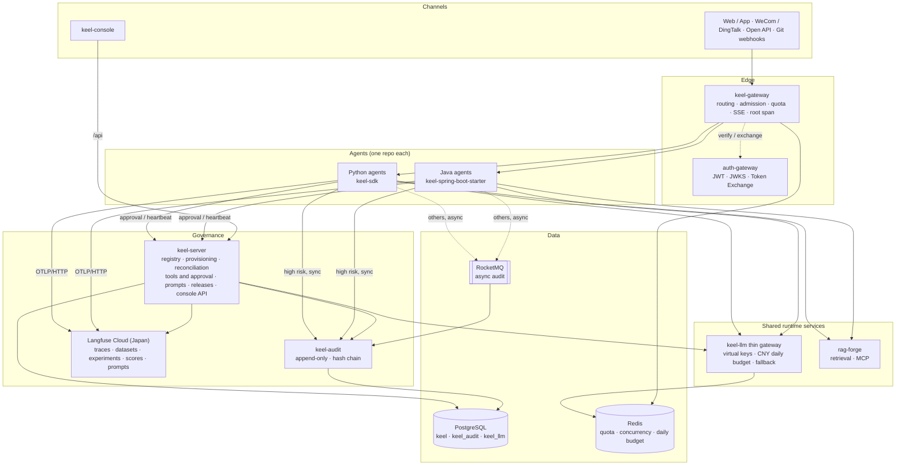
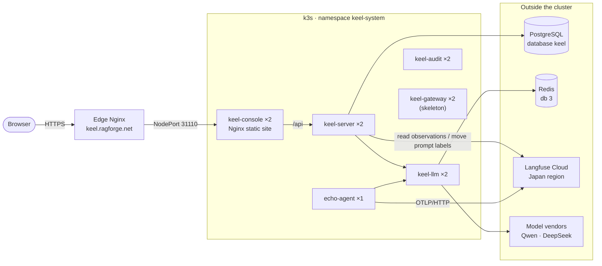

[简体中文](README.md) | **English**

# Keel: Agent Platform Foundation

A keel is the beam that runs along the bottom of a ship. Every ship carries different cargo, but they all rely on the keel to bear the load.

Keel plays the same role for AI agents. Authentication, model access, knowledge retrieval, tracing, audit, evaluation, prompt management, and tool approval are handled by the platform. Each agent only writes its own business logic and fills in one `agent.yaml`.

**Goal**: a new agent can be onboarded within a day; existing agents (askdb, offshore-wind, careermate, and others) migrate one by one and delete their duplicated tracing, audit, evaluation, and quality code. Eventually all 10 agents are managed from a single console.

> Keel is not an agent framework and does not dictate how an agent reasons internally. It governs how many agents are provisioned, invoked, observed, evaluated, and released safely.

## Contents

- [What the platform provides](#what-the-platform-provides)
- [Architecture](#architecture)
- [Repository layout](#repository-layout)
- [Tech stack](#tech-stack)
- [Status](#status)
- [Local development](#local-development)
- [Deployment](#deployment)
- [Contracts and conventions](#contracts-and-conventions)
- [Documentation](#documentation)

## What the platform provides

| Capability | How an agent uses it | Owned by |
|---|---|---|
| Invocation protocol | Implements `/v1/invoke` (SSE), `/v1/health`, `/v1/manifest`, `/v1/feedback`; the SDK mounts them automatically | `contracts/invoke.openapi.yaml` |
| Auth and delegation | `ctx.delegate` exchanges tokens and propagates `traceparent` | auth-gateway (JWT, JWKS, Token Exchange), admission at keel-gateway |
| Model access | Only through `ctx.llm`; importing vendor SDKs directly is forbidden | keel-llm thin gateway: virtual keys, daily budgets in CNY, fallback |
| Knowledge retrieval | `ctx.knowledge.search(...)` | rag-forge (shared service) |
| Tracing | The SDK reports generation / tool / agent spans via OpenTelemetry | Langfuse Cloud, Japan region |
| Audit | High-risk actions are written synchronously, the rest asynchronously; only `captureFields` are kept | keel-audit: append-only, one hash chain per agent |
| Tools and approval | High-risk tool calls suspend for approval and resume once approved | keel-server: tool registry, approval requests, run lifecycle |
| Prompts | `ctx.prompt("answer")` resolves by environment label, with a local fallback copy | Langfuse prompt management; keel-server moves labels and checks for drift |
| Evaluation gate | `evals/seed.jsonl` + `@scorer`, `keel gate` in CI | Langfuse datasets and experiments; a release is blocked if scores regress |
| Registration and reconciliation | `keel register` / `keel release` / `keel retire` | keel-server: provisions resources, rolls back in reverse order on failure, reconciles every 5 minutes |

## Architecture



The path of one request (an ops copilot delegating to askdb):

1. The frontend calls `POST /agents/ops-copilot/v1/invoke` with a JWT issued by auth-gateway (`aud=keel-api`).
2. keel-gateway verifies the token, admits it by roles / scopes, charges quota, takes a concurrency slot, creates the root `traceparent`, then exchanges the token for `aud=ops-copilot` and forwards the request.
3. ops-copilot plans with `ctx.llm` through the thin gateway, then uses `ctx.delegate` to exchange a token and call askdb's `/v1/invoke` directly inside the cluster.
4. Each agent exports its spans to Langfuse over OTLP/HTTP asynchronously. A high-risk tool first creates an approval request in keel-server and suspends; once approved it resumes and writes to keel-audit synchronously.
5. The gateway streams SSE back to the frontend, then releases the concurrency slot and records an invocation audit event.
6. The console's trace page asks keel-server, which reads the whole trace back from Langfuse and overlays audit and approval data.

## Repository layout

```text
keel/
├── contracts/                  # keel/v1 contracts, the single source of truth across languages
│   ├── manifest.schema.json    #   JSON Schema for agent.yaml
│   ├── invoke.openapi.yaml     #   agent protocol
│   ├── sse-events.schema.json  #   step / tool / token / final / error / suspend
│   ├── audit-event.schema.json
│   ├── console-api.openapi.yaml#   console API (shared by frontend, mocks, and backend)
│   ├── trace-attributes.md     #   keel.* and langfuse.* attribute conventions
│   ├── error-codes.yaml        #   platform-wide error codes
│   └── tests/                  #   contract cases shared by the SDK and the starter
├── keel-common/                # Java: contract models, error codes
├── keel-server/                # control plane: registry / provisioning / discovery / tool / approval /
│                               #   prompt / release / insight / auth (console login)
├── keel-audit/                 # audit: ingest, hash chain, query, export, archive
├── keel-gateway/               # edge gateway (Spring Cloud Gateway / WebFlux)
├── keel-llm/                   # in-house thin gateway: OpenAI-compatible, virtual keys, CNY daily budget
├── keel-spring-boot-starter/   # Java agent runtime
├── sdk-python/                 # Python keel-sdk: runtime + keel CLI + keel-lite + keel-gate
├── console/                    # Vue 3 console
├── templates/                  # keel new templates: chat-rag / tool-agent / graph-agent / supervisor / java-spring
├── agents/echo/                # built-in echo agent for integration and smoke tests
├── deploy/                     # k3s manifests, Dockerfiles, edge Nginx, CD scripts
├── ci/                         # change detection, backend and frontend gates
├── scripts/                    # contract validation, code generation
└── docs/                       # design doc, technical doc, console prototype, task specs
```

## Tech stack

| Layer | Choice |
|---|---|
| Java services | Java 21, Spring Boot 3.5.15, MyBatis-Plus, Flyway; keel-gateway on Spring Cloud Gateway (WebFlux), the rest on Spring MVC with virtual threads |
| Python SDK | Python 3.11+, Starlette (mountable into an existing FastAPI app), pydantic v2, httpx, OpenTelemetry (OTLP/HTTP) |
| Frontend | Vue 3, Vite 5, TypeScript, Element Plus, Pinia, MSW (mocks during development) |
| Models | In-house thin gateway keel-llm (OpenAI-compatible), currently routing qwen-plus and deepseek-v3 |
| Tracing / evaluation / prompts | Langfuse Cloud v4, Japan region `https://jp.cloud.langfuse.com` |
| Middleware | PostgreSQL 16, Redis 7, RocketMQ 5 (existing cluster) |
| Operations | k3s, Docker, GitHub Actions, Alibaba Cloud ACR |

## Status

P0 (contracts and SDK) and P1 (platform core) are in progress; prompt management from P2 has landed. See [docs/TASKS.md](docs/TASKS.md) for the task breakdown.

| Module | Status |
|---|---|
| `contracts/` | keel/v1 frozen (tag `contracts/v1.0.0`) |
| `keel-server` | Registry, reconciliation and probing, provisioning, trace list and detail, overview and cost, four-environment prompt labels, approval inbox, console login and preview mode are implemented |
| `keel-llm` | Live: chat and embedding calls, virtual keys, daily budget in Redis. Spend records are still held in process memory and are lost when a pod restarts |
| `console` | Overview, agents, traces, prompts, shared services, tools, model gateway, evaluation, and other pages call real APIs; endpoints not implemented yet are served by MSW mocks in development mode |
| `sdk-python` | Runtime, tracing, keel-lite, prompts, delegation, `keel new` / `keel dev` work; the `register` / `release` / `eval` / `gate` commands are not implemented yet |
| `keel-spring-boot-starter` | Protocol endpoints and tracing are implemented; `LlmClient`, `ToolInvoker`, `Delegator`, and guards are still empty shells |
| `keel-audit` | Hash chain and verification logic are implemented; storage is in-process for now, PostgreSQL persistence is not wired yet |
| `keel-gateway` | Package skeleton only; none of the filters are implemented yet (lightweight version planned for P2) |

## Local development

### Console + keel-server

No Docker required. You need JDK 21, Maven 3.9, Node 20+, and a local PostgreSQL on port 5432. Scope is described in the [P1-0 spec](docs/specs/p1/P1-0-runnable-baseline.md).

```bash
# 1. Create the database (once)
psql -h localhost -d postgres -c "CREATE ROLE keel LOGIN PASSWORD 'keel'" -c "CREATE DATABASE keel OWNER keel"

# 2. keel-server (the local profile creates tables and loads demo data)
mvn -pl :keel-server -am package -DskipTests
java -Xmx384m -jar keel-server/target/keel-server-0.1.0-SNAPSHOT.jar --spring.profiles.active=local

# 3. console (/api is proxied to localhost:8080)
cd console && npm install && npm run dev    # open http://localhost:5173
```

- Run `VITE_API_MOCK=off npm run dev` to turn mocks off and hit real APIs only.
- Without Docker, tests that depend on Testcontainers are skipped locally and still run in CI. Do not replace PostgreSQL with H2.

### Python SDK and agents

```bash
cd sdk-python && pip install -e ".[test]"
keel new my-agent --template tool-agent     # generates agent.yaml, app.py, evals, Dockerfile
cd my-agent && keel dev                     # hot reload; audit and approvals go to local keel-lite (SQLite)
```

A minimal agent:

```python
from keel import Agent, Context

agent = Agent.from_manifest("agent.yaml")

@agent.entry
async def handle(req, ctx: Context):
    rules = await ctx.knowledge.search("dev-standards", req.input["question"], top_k=8)
    reply = await ctx.llm.chat(messages=[{"role": "user", "content": req.input["question"]}])
    return ctx.final(reply, citations=rules.citations)

app = agent.asgi()
```

### What to run after a change

Run only what your change touches locally. Full test suites, integration tests, and coverage gates run in CI only.

| Changed | Run |
|---|---|
| Java | `mvn -o -pl :{module} test` |
| Python | `pytest --testmon` or `pytest tests/{matching dir}` |
| Vue | `npx vitest related {changed files}` |
| Contracts | `bash scripts/validate-contracts.sh` |

## Deployment

All Keel workloads run in the `keel-system` namespace of the existing k3s cluster. Pushing to `main` triggers [`.github/workflows/keel-cd.yml`](.github/workflows/keel-cd.yml), which tests and releases only the services whose paths changed.



| Workload | Replicas | Per replica (requests / limits) | Exposure |
|---|---|---|---|
| keel-console | 2 | 100m · 64Mi / 200m · 128Mi | NodePort 31110, pages and `/api` |
| keel-server | 2 | 500m · 512Mi / 1 core · 1Gi | Cluster only, reverse-proxied by the console |
| keel-llm | 2 | 100m · 256Mi / 500m · 512Mi | Cluster only; `/admin` is never public |
| keel-audit | 2 | 100m · 256Mi / 500m · 512Mi | Cluster only |
| keel-gateway | 2 | 100m · 256Mi / 500m · 512Mi | Cluster only |
| echo-agent | 1 | 100m · 256Mi / 1 core · 1Gi | Cluster only |

Key points:

- **Secrets**: vendor API keys live only in the Secret `keel-llm-vendors`; neither agents nor keel-server can read them. Each agent gets its own Secret `keel-{agent}`, created by keel-server at registration and removed at retirement. A missing Secret leaves the pod in `CreateContainerConfigError`, on purpose.
- **Prices**: defined in `keel-llm/src/main/resources/application.yaml` and shipped with the image. If a price is missing or zero, the process refuses to start, so cost is never silently recorded as 0.
- **Daily budget**: both keel-llm replicas share one Redis database so they enforce the same budget.
- **One Langfuse project for all four environments**: traces are separated by `keel.env`, prompts by label (dev → `dev`, test → `test`, staging → `staging`, prod → `production`).
- **Images**: pushed to Alibaba Cloud ACR, tagged with the first 12 characters of the commit SHA. Pull requests run tests and gates only and push no images.

One-time setup, Secret creation commands, verification, and rollback steps are in [deploy/README.md](deploy/README.md) (Chinese).

## Contracts and conventions

The full rule set is in [AGENTS.md](AGENTS.md). The ones people trip over most:

- **Contracts first**: change cross-language data structures in `contracts/` first, then update the Java and Python models. v1 only accepts new optional fields; removing a field requires v2.
- **No direct model calls**: call models only through `ctx.llm` / `ctx.llm()`. Vendor API keys must never appear in code, config, or tests.
- **Audit never degrades**: actions with `risk: high` must write audit synchronously and refuse to run if the write fails. When the report queue is full, traces are dropped but audit never is. `audit_event` is never updated or deleted.
- **Error codes**: format `{MODULE}_{REASON}`, all registered in `contracts/error-codes.yaml`; error body is `{code, message, trace_id, retryable}`; SSE errors are sent as `event: error` instead of dropping the connection.
- **Logs**: every log line carries `trace_id` and `agent`. Keel's own service tracing goes to SkyWalking; agent semantic tracing goes to Langfuse.
- **Do not write external APIs from memory**: the correct usage of Langfuse Cloud v4, the thin gateway, and auth-gateway is in [.cursor/rules/external-apis.mdc](.cursor/rules/external-apis.mdc).
- **Spec before code**: every task has a spec under `docs/specs/`; write one first if it is missing.

Open the repository root in Cursor so that `AGENTS.md`, `.cursor/rules/`, and `.cursor/hooks.json` apply to AI coding assistants.

## Documentation

Documents live under `docs/`, grouped by package; the index is [docs/README.md](docs/README.md). The technical document wins when documents disagree. All documents are in Chinese.

| File | Content |
|---|---|
| [docs/architecture/Keel-技术文档.html](docs/architecture/Keel-技术文档.html) | Implementation details, the authoritative source: packages, database, APIs, key flows, pre-build verification |
| [docs/design/Keel-智能体底座设计.html](docs/design/Keel-智能体底座设计.html) | Design rationale and the original text of the five onboarding contracts |
| [docs/console/Keel-控制台前端.html](docs/console/Keel-控制台前端.html) | Interactive console prototype; open it directly in a browser |
| [docs/TASKS.md](docs/TASKS.md) | Task breakdown and progress |
| [docs/specs/](docs/specs/) | One spec per task; read it before changing code |
| [deploy/README.md](deploy/README.md) | Deployment, Secrets, verification, and rollback |
