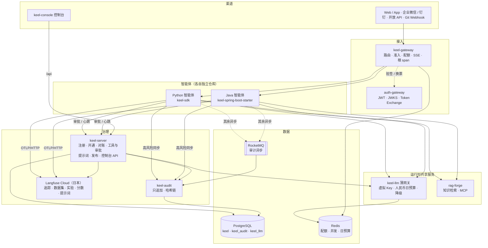
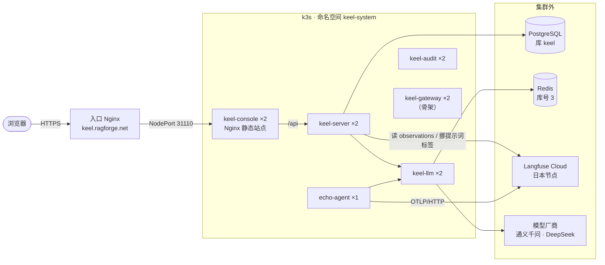

**简体中文** | [English](README.en.md)

# Keel 智能体平台底座

龙骨是船底那根纵梁。船上装什么货各不相同，但每条船都靠它承重。

Keel 对智能体是同一个角色：鉴权、模型调用、知识检索、链路追踪、审计、评测、提示词管理、工具审批由底座承担，每个智能体只写自己的业务逻辑、填一份 `agent.yaml`。

**目标**：新智能体一天内接入底座；旧智能体（askdb、offshore-wind、careermate 等）逐个迁移，删掉各自重复的追踪、审计、评测、质量代码。最终 10 个智能体在同一个控制台里管理。

> Keel 不是 agent 框架，不规定智能体内部怎么推理。它管的是很多智能体怎么被安全地开通、调用、观测、评测和发布。

## 目录

- [底座提供什么](#底座提供什么)
- [总体架构](#总体架构)
- [仓库结构](#仓库结构)
- [技术栈](#技术栈)
- [当前进度](#当前进度)
- [本地开发](#本地开发)
- [部署架构](#部署架构)
- [契约与开发规范](#契约与开发规范)
- [文档](#文档)

## 底座提供什么

| 能力 | 智能体侧怎么用 | 底座侧由谁负责 |
|---|---|---|
| 统一调用协议 | 实现 `/v1/invoke`（SSE）、`/v1/health`、`/v1/manifest`、`/v1/feedback`，SDK 自动挂好 | `contracts/invoke.openapi.yaml` |
| 鉴权与委派 | `ctx.delegate` 自动换票、透传 traceparent | auth-gateway（JWT、JWKS、Token Exchange），keel-gateway 准入 |
| 模型调用 | 只能走 `ctx.llm`，禁止直连厂商 SDK | 薄网关 keel-llm：虚拟 Key、人民币日预算、降级 |
| 知识检索 | `ctx.knowledge.search(...)` | rag-forge（共享服务） |
| 链路追踪 | SDK 用 OTel 自动上报 generation / tool / agent span | Langfuse Cloud 日本节点 |
| 审计 | 高风险动作同步写，其余异步；只收 `captureFields` 白名单 | keel-audit：只追加、按智能体哈希链 |
| 工具与审批 | 高风险工具调用自动挂起等审批，批准后恢复现场 | keel-server：工具注册、审批单、运行生命周期 |
| 提示词 | `ctx.prompt("answer")`，按环境标签取，本地副本兜底 | Langfuse 提示词管理 + keel-server 挪标签、漂移检查 |
| 评测与门禁 | `evals/seed.jsonl` + `@scorer`，CI 里 `keel gate` | Langfuse 数据集与实验，不达标阻止发布 |
| 注册与对账 | `keel register` / `keel release` / `keel retire` | keel-server：开通资源、失败逆序回收、每 5 分钟对账 |

## 总体架构



一次调用的路径（以"运维总控委派给 askdb"为例）：

1. 前端带 auth-gateway 签发的 JWT（`aud=keel-api`）调 `POST /agents/ops-copilot/v1/invoke`。
2. keel-gateway 验签，按 roles / scopes 准入，扣配额、占并发位，生成根 traceparent，再换票成 `aud=ops-copilot` 转发。
3. ops-copilot 用 `ctx.llm` 经薄网关做规划，用 `ctx.delegate` 换票后在集群内直连 askdb 的 `/v1/invoke`。
4. 各智能体的 span 通过 OTLP/HTTP 异步上报 Langfuse；高风险工具先在 keel-server 建审批单并挂起，批准后恢复执行，同步写 keel-audit。
5. 网关 SSE 透传回前端，结束后释放并发位、写一条调用审计。
6. 控制台追踪页由 keel-server 从 Langfuse 读回整条链路，叠加审计和审批信息。

## 仓库结构

```text
keel/
├── contracts/                  # keel/v1 契约，跨语言唯一事实来源
│   ├── manifest.schema.json    #   agent.yaml 的 JSON Schema
│   ├── invoke.openapi.yaml     #   智能体协议
│   ├── sse-events.schema.json  #   step / tool / token / final / error / suspend
│   ├── audit-event.schema.json
│   ├── console-api.openapi.yaml#   控制台 API（前端 / mock / 后端三方共用）
│   ├── trace-attributes.md     #   keel.* 与 langfuse.* 属性约定
│   ├── error-codes.yaml        #   全平台错误码
│   └── tests/                  #   SDK 和 starter 共用的契约用例
├── keel-common/                # Java：契约模型、错误码
├── keel-server/                # 控制面：registry / provisioning / discovery / tool / approval /
│                               #   prompt / release / insight / auth（控制台登录）
├── keel-audit/                 # 审计：写入、哈希链、查询、导出、归档
├── keel-gateway/               # 入口网关（Spring Cloud Gateway / WebFlux）
├── keel-llm/                   # 自研薄网关：OpenAI 兼容、虚拟 Key、人民币日预算
├── keel-spring-boot-starter/   # Java 智能体运行时
├── sdk-python/                 # Python keel-sdk：运行时 + keel CLI + keel-lite + keel-gate
├── console/                    # Vue 3 控制台
├── templates/                  # keel new 模板：chat-rag / tool-agent / graph-agent / supervisor / java-spring
├── agents/echo/                # 内置回声智能体，用于联调和冒烟
├── deploy/                     # k3s 清单、Dockerfile、入口 Nginx、CD 脚本
├── ci/                         # 变更范围判定、前后端门禁脚本
├── scripts/                    # 契约校验、代码生成
└── docs/                       # 设计文档、技术文档、控制台原型、任务 spec
```

## 技术栈

| 分层 | 选型 |
|---|---|
| Java 服务 | Java 21、Spring Boot 3.5.15、MyBatis-Plus、Flyway；keel-gateway 用 Spring Cloud Gateway（WebFlux），其余用 Spring MVC + 虚拟线程 |
| Python SDK | Python 3.11+、Starlette（可挂进现有 FastAPI）、pydantic v2、httpx、OpenTelemetry（OTLP/HTTP） |
| 前端 | Vue 3、Vite 5、TypeScript、Element Plus、Pinia、MSW（开发期 mock） |
| 模型 | 自研薄网关 keel-llm（OpenAI 兼容），当前接 qwen-plus、deepseek-v3 |
| 追踪 / 评测 / 提示词 | Langfuse Cloud v4 日本节点 `https://jp.cloud.langfuse.com` |
| 中间件 | PostgreSQL 16、Redis 7、RocketMQ 5（复用现有集群） |
| 运维 | k3s、Docker、GitHub Actions、阿里云 ACR |

## 当前进度

P0（契约与 SDK）和 P1（平台核心）进行中，P2 的提示词管理已落地。任务拆解见 [docs/TASKS.md](docs/TASKS.md)。

| 模块 | 状态 |
|---|---|
| `contracts/` | keel/v1 已冻结（tag `contracts/v1.0.0`） |
| `keel-server` | 注册表、对账与探活、开通编排、链路详情与列表、总览与成本、提示词四环境标签、审批待办、控制台登录与预览模式已实现 |
| `keel-llm` | 已上线：对话与向量化调用、虚拟 Key、Redis 日预算。花费明细仍在进程内存，Pod 重启丢失 |
| `console` | 总览、智能体、链路追踪、提示词、共享服务、工具、模型网关、评测等页面已接真接口；未实现的接口在开发模式下由 MSW 返回 mock |
| `sdk-python` | 运行时、追踪、keel-lite、提示词、委派、`keel new` / `keel dev` 可用；`register` / `release` / `eval` / `gate` 命令尚未实现 |
| `keel-spring-boot-starter` | 协议端点和追踪已实现；`LlmClient`、`ToolInvoker`、`Delegator`、护栏等仍是空壳 |
| `keel-audit` | 哈希链与校验逻辑已实现，存储目前是进程内实现，PostgreSQL 落库待接 |
| `keel-gateway` | 只有包结构骨架，过滤器均未实现（P2 轻量版） |

## 本地开发

### 控制台 + keel-server

不需要 Docker。前提：JDK 21、Maven 3.9、Node 20+，本机 PostgreSQL 监听 5432。范围见 [P1-0 spec](docs/specs/p1/P1-0-runnable-baseline.md)。

```bash
# 1. 建库（只需一次）
psql -h localhost -d postgres -c "CREATE ROLE keel LOGIN PASSWORD 'keel'" -c "CREATE DATABASE keel OWNER keel"

# 2. keel-server（local profile 会自动建表并灌演示数据）
mvn -pl :keel-server -am package -DskipTests
java -Xmx384m -jar keel-server/target/keel-server-0.1.0-SNAPSHOT.jar --spring.profiles.active=local

# 3. console（/api 代理到 localhost:8080）
cd console && npm install && npm run dev    # 打开 http://localhost:5173
```

- 用 `VITE_API_MOCK=off npm run dev` 关掉 mock，全部走真接口。
- 本地没有 Docker 时，依赖 Testcontainers 的测试自动跳过，CI 上照常执行。不要改用 H2 替代 PostgreSQL。

### Python SDK 与智能体

```bash
cd sdk-python && pip install -e ".[test]"
keel new my-agent --template tool-agent     # 生成 agent.yaml、app.py、evals、Dockerfile
cd my-agent && keel dev                     # 热重载；审计、审批走本地 keel-lite（SQLite）
```

一个最小的智能体：

```python
from keel import Agent, Context

agent = Agent.from_manifest("agent.yaml")

@agent.entry
async def handle(req, ctx: Context):
    rules = await ctx.knowledge.search("dev-standards", req.input["question"], top_k=8)
    reply = await ctx.llm.chat(messages=[{"role": "user", "content": req.input["question"]}])
    return ctx.final(reply, citations=rules.citations)

app = agent.asgi()
```

### 改完代码跑什么

本地只跑受影响的部分，全量测试、集成测试、覆盖率门禁只在 CI 跑。

| 改了什么 | 跑什么 |
|---|---|
| Java | `mvn -o -pl :{模块} test` |
| Python | `pytest --testmon` 或 `pytest tests/{对应目录}` |
| Vue | `npx vitest related {改动文件}` |
| 契约 | `bash scripts/validate-contracts.sh` |

## 部署架构

所有 Keel 工作负载跑在现有 k3s 集群的 `keel-system` 命名空间。推 `main` 触发 [`.github/workflows/keel-cd.yml`](.github/workflows/keel-cd.yml)，按改动路径只测试和发布被改到的服务。



| 工作负载 | 副本 | 单副本资源（requests / limits） | 对外 |
|---|---|---|---|
| keel-console | 2 | 100m · 64Mi / 200m · 128Mi | NodePort 31110，页面和 `/api` |
| keel-server | 2 | 500m · 512Mi / 1 核 · 1Gi | 仅集群内，由控制台反代 |
| keel-llm | 2 | 100m · 256Mi / 500m · 512Mi | 仅集群内，`/admin` 不对公网 |
| keel-audit | 2 | 100m · 256Mi / 500m · 512Mi | 仅集群内 |
| keel-gateway | 2 | 100m · 256Mi / 500m · 512Mi | 仅集群内 |
| echo-agent | 1 | 100m · 256Mi / 1 核 · 1Gi | 仅集群内 |

要点：

- **密钥**：厂商 API Key 只在 Secret `keel-llm-vendors` 里，智能体和 keel-server 都拿不到。每个智能体一个 Secret `keel-{agent}`，由 keel-server 注册时创建、下线时回收。Secret 缺失时 Pod 停在 `CreateContainerConfigError`，这是有意的。
- **单价**：写在 `keel-llm/src/main/resources/application.yaml`，随镜像发布。缺单价或写成 0，进程拒绝启动，不允许成本静默记 0。
- **日预算**：两个 keel-llm 副本共用同一个 Redis 库，日预算才是同一份。
- **四套环境共用一个 Langfuse 项目**：链路按 `keel.env` 区分，提示词按标签区分（dev → `dev`，test → `test`，staging → `staging`，prod → `production`）。
- **镜像**：推阿里云 ACR，tag 为 commit sha 前 12 位。pull request 只跑测试和门禁，不推镜像。

一次性准备、Secret 创建命令、验证和回滚步骤见 [deploy/README.md](deploy/README.md)。

## 契约与开发规范

完整约束见 [AGENTS.md](AGENTS.md)，这里只列最容易踩的几条：

- **契约先行**：跨语言的数据结构先改 `contracts/`，再让 Java 和 Python 模型跟着改。v1 只能加可选字段，删字段要升 v2。
- **不直连模型**：调模型只能走 `ctx.llm` / `ctx.llm()`，代码、配置、测试里不允许出现厂商 API Key。
- **审计不降级**：`risk: high` 的动作必须同步写审计，写失败就拒绝执行。上报队列满时丢追踪，绝不丢审计。`audit_event` 不允许 UPDATE / DELETE。
- **错误码**：格式 `{模块}_{原因}`，全部登记在 `contracts/error-codes.yaml`；错误体统一 `{code, message, trace_id, retryable}`；SSE 出错发 `event: error`，不直接断连。
- **日志**：所有日志带 `trace_id` 和 `agent`。Keel 服务自身的追踪进 SkyWalking，智能体语义追踪进 Langfuse。
- **外部接口不凭记忆写**：Langfuse Cloud v4、薄网关、auth-gateway 的正确用法见 [.cursor/rules/external-apis.mdc](.cursor/rules/external-apis.mdc)。
- **先有 spec 再动代码**：每条任务在 `docs/specs/` 下有一份 spec，没有就先写。

用 Cursor 打开本仓库根目录，`AGENTS.md`、`.cursor/rules/` 和 `.cursor/hooks.json` 才会对 AI 编码助手生效。

## 文档

文档在 `docs/` 下按包分类，索引见 [docs/README.md](docs/README.md)。冲突时以技术文档为准。

| 文件 | 内容 |
|---|---|
| [docs/architecture/Keel-技术文档.html](docs/architecture/Keel-技术文档.html) | 实现细节，最权威。包结构、数据库、接口、关键流程、开工前核实结论 |
| [docs/design/Keel-智能体底座设计.html](docs/design/Keel-智能体底座设计.html) | 为什么这样设计，五份接入契约的原文 |
| [docs/console/Keel-控制台前端.html](docs/console/Keel-控制台前端.html) | 控制台页面交互原型，双击即可打开 |
| [docs/TASKS.md](docs/TASKS.md) | 任务拆解与进度 |
| [docs/specs/](docs/specs/) | 每条任务一份 spec，动手前先读 |
| [deploy/README.md](deploy/README.md) | 部署、Secret、验证与回滚 |
